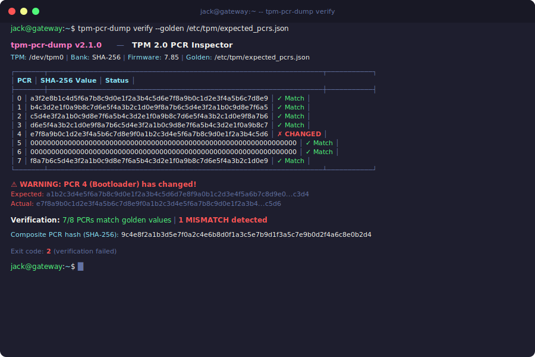

# tpm-pcr-dump v2.1.0

[](https://github.com/isecwire/tpm-pcr-dump/actions/workflows/ci.yml)
[](LICENSE)
[](https://en.wikipedia.org/wiki/C11_(C_standard_revision))

Advanced TPM 2.0 PCR (Platform Configuration Register) reader, event log parser, PCR simulator, and attestation tool.
Pure C11, minimal dependencies, designed for embedded Linux systems.



## Overview

Trusted Platform Module (TPM) 2.0 devices maintain a set of Platform Configuration Registers
(PCRs) that record the measurement chain during system boot.  Each stage of the boot process
-- firmware, bootloader, kernel, initramfs, and critical user-space components -- extends
a specific PCR with a hash of the code or configuration it is about to execute.

Because PCR values can only be *extended* (never directly written), they form a tamper-evident
log of everything that ran since reset.  By comparing the current PCR values against a known-good
("golden") set, administrators and automated systems can verify that the secure boot chain has
not been altered.

`tpm-pcr-dump` provides a comprehensive, dependency-light tool for reading, verifying, simulating,
and attesting PCR values on embedded Linux targets where installing the full `tpm2-tools` suite
may be impractical.

### Standard PCR Allocation (PC Client Profile)

| PCR   | Measurement                                    |
|-------|------------------------------------------------|
| 0     | UEFI firmware code (BIOS/UEFI)                |
| 1     | UEFI firmware configuration (NVRAM variables)  |
| 2     | Option ROM code                                |
| 3     | Option ROM configuration and data              |
| 4     | Boot loader code (GRUB, shim, systemd-boot)    |
| 5     | Boot loader configuration (GPT, GRUB config)   |
| 6     | Host platform manufacturer specific            |
| 7     | Secure Boot policy (db, dbx, KEK, PK)          |
| 8-15  | OS and application defined                     |
| 16    | Debug / test                                   |
| 17-22 | Dynamic root of trust (Intel TXT / AMD SKINIT) |
| 23    | Application-specific                           |

## Features

### Core Capabilities
- Read individual or all 24 PCRs from **SHA-1, SHA-256, SHA-384, SHA-512, and SM3-256** banks
- Multiple access methods: Linux sysfs (`/sys/class/tpm/tpm0/pcr-sha256/`) and `tpm2_pcrread` fallback
- Verify PCR values against a golden configuration file
- Compute composite PCR hash for remote attestation workflows

### Event Log Parsing (NEW)
- Parse **TCG2 binary BIOS measurements** from `/sys/kernel/security/tpm0/binary_bios_measurements`
- Support for both **TCG1 (SHA-1 only)** and **TCG2 (crypto-agile)** event log formats
- Decode all standard event types: `EV_POST_CODE`, `EV_SEPARATOR`, `EV_EFI_VARIABLE_DRIVER_CONFIG`, `EV_EFI_BOOT_SERVICES_APPLICATION`, `EV_EFI_GPT_EVENT`, and 30+ more
- Extract human-readable descriptions from event data (UEFI variable names, boot application paths)
- **Replay verification**: replay event log against actual PCR values to verify log integrity

### PCR Simulation Engine (NEW)
- **PCR simulation**: calculate expected PCR values from events without a TPM
- **What-if analysis**: simulate extending a PCR with a new measurement, preview the resulting value
- **Boot measurement chain visualization**: trace the sequence of measurements that produced each PCR
- **Policy matching**: compare simulated vs. actual PCR values to determine if a sealing policy would pass

### Attestation Support (NEW)
- **Quote preparation**: generate nonce, build PCR selection structure, compute PCR composite digest
- **Quote digest verification**: verify a PCR composite digest against actual TPM values
- **Attestation report**: structured report with system info, PCR values, event log summary, verification status, and quote parameters
- Reports available in both human-readable (colored tables) and JSON formats

### PCR Snapshot Diff (NEW)
- Compare two PCR snapshot files side-by-side
- Highlight differences with color coding
- JSON diff output for automation

### CLI Polish (NEW)
- **Subcommand architecture**: `read`, `verify`, `eventlog`, `simulate`, `attest`, `diff`
- **Colored terminal output**: green for verified, red for mismatch, yellow for warnings, cyan for info
- **ASCII art banner** with TPM information
- **Formatted table output** with Unicode box-drawing characters
- **Multiple output formats**: `--format table` (default), `--format json`, `--format csv`
- **Color control**: `--color` / `--no-color` flags (auto-detects terminal)
- Full backward compatibility with v1.x command-line flags

### Architecture
- Pure C11, single external dependency: OpenSSL (libcrypto)
- Zero dynamic allocation philosophy: fixed-size buffers with bounds checking throughout
- All buffers overflow-protected; all return codes checked
- Cross-compilable for ARM, AArch64, RISC-V embedded targets

## Source Structure

```
src/
  main.c            Entry point, argument parsing, legacy mode compat
  commands.c/.h     Subcommand dispatch and implementations
  tpm_interface.c/.h  TPM access layer (sysfs + tpm2-tools fallback)
  pcr_verify.c/.h   PCR verification against golden values
  event_log.c/.h    TCG event log parser (TCG1 + TCG2 crypto-agile)
  event_types.c/.h  Event type definitions and decoders (35+ types)
  simulator.c/.h    PCR simulation engine with what-if analysis
  attestation.c/.h  Attestation helpers (quote, report generation)
  table_fmt.c/.h    ASCII table formatter with box-drawing characters
  color.c/.h        ANSI color output (auto-detect terminal)
  json_writer.c/.h  Minimal JSON writer (no heap, fixed buffer)
  utils.c/.h        Hex conversion, string utils, debug/error output
include/
  tpm_pcr_dump.h    Core types, constants, hash bank definitions
tests/
  test_framework.h  Minimal hand-rolled test framework
  test_main.c       Test runner
  test_utils.c      Utils unit tests
  test_json_writer.c JSON writer unit tests
  test_pcr_verify.c PCR verify unit tests
```

## Building

### Prerequisites

- GCC or Clang with C11 support
- OpenSSL development headers (`libssl-dev` / `openssl-devel`)

### Compile

```sh
make
```

### Install

```sh
sudo make install              # installs to /usr/local/bin
sudo make PREFIX=/usr install  # custom prefix
```

### Cross-compile for embedded targets

```sh
make CC=arm-linux-gnueabihf-gcc
make CC=aarch64-linux-gnu-gcc
make CC=riscv64-linux-gnu-gcc
```

### Run tests

```sh
make test
```

## Usage

```
tpm-pcr-dump <command> [options]

Commands:
  read       Read PCR values from TPM
  verify     Verify PCRs against golden values
  eventlog   Parse and display TPM2 event log
  simulate   PCR simulation and what-if analysis
  attest     Generate attestation report
  diff       Compare two PCR snapshots

Global Options:
  -b, --bank BANK     Hash bank: sha1, sha256, sha384, sha512, sm3_256
                      (default: sha256)
  -p, --pcr INDEX     Select a single PCR (0-23)
  --format FMT        Output format: table (default), json, csv
  --color             Force colored output
  --no-color          Disable colored output
  --no-banner         Suppress the ASCII art banner
  -d, --debug         Enable debug output
  -h, --help          Show this help
  -V, --version       Show version
```

### Read PCR Values

```sh
# Read all SHA-256 PCRs (default)
tpm-pcr-dump read

# Read all SHA-384 PCRs as JSON
tpm-pcr-dump read -b sha384 --format json

# Read a single PCR from the SHA-1 bank
tpm-pcr-dump read -b sha1 -p 7

# CSV output (for scripting)
tpm-pcr-dump read --format csv
```

### Verify Against Golden Values

```sh
# Verify secure boot chain
tpm-pcr-dump verify --golden expected_pcrs.json

# JSON output for CI pipelines
tpm-pcr-dump verify --golden expected_pcrs.json --format json
echo $?   # 0 = pass, 2 = mismatch
```

### Parse Event Log

```sh
# Parse the default BIOS measurements log
tpm-pcr-dump eventlog

# Parse a specific event log file
tpm-pcr-dump eventlog --log /path/to/binary_bios_measurements

# JSON output with all events and digests
tpm-pcr-dump eventlog --format json

# The eventlog command automatically performs replay verification
# if the TPM is accessible, comparing replayed PCR values against
# actual TPM values to detect log tampering.
```

### PCR Simulation

```sh
# Simulate PCR values by replaying an event log
tpm-pcr-dump simulate --log /path/to/binary_bios_measurements

# What-if analysis: what would PCR 7 be after extending with a digest?
tpm-pcr-dump simulate -p 7 --extend abc123...deadbeef

# The simulator automatically compares against actual TPM values
# when available, showing whether a TPM2_PolicyPCR would pass.
```

### Attestation Report

```sh
# Full attestation report with PCRs, event log, and quote parameters
tpm-pcr-dump attest

# Include golden value verification in the report
tpm-pcr-dump attest --golden expected_pcrs.json

# Include event log analysis
tpm-pcr-dump attest --log /path/to/measurements

# JSON attestation report (for remote attestation servers)
tpm-pcr-dump attest --format json

# Select specific PCRs for quote (bitmask)
tpm-pcr-dump attest --pcr-mask 0xFF   # PCRs 0-7 only
```

### Compare PCR Snapshots

```sh
# Compare two snapshot files
tpm-pcr-dump diff snapshot_before.json snapshot_after.json

# JSON diff output
tpm-pcr-dump diff snapshot_a.json snapshot_b.json --format json
```

### Legacy Mode (v1.x Compatibility)

The original v1.x command-line flags still work:

```sh
tpm-pcr-dump -a                       # Read all PCRs
tpm-pcr-dump -b sha1 -p 0             # Read PCR 0, SHA-1
tpm-pcr-dump -a -j                    # JSON output
tpm-pcr-dump -v expected_pcrs.json    # Verify
```

### Golden Values File Format

The verification file uses a simple JSON format:

```json
{
  "bank": "sha256",
  "pcrs": {
    "0": "3d458cfe55cc03ea1f443f1562beec8df51c75e14a9fcf9a7234a13f198e7969",
    "7": "65c4c418b18ee3bb96d77f8df7f1e3a8b3f09c7ea2a43e6ef14c18e9b36f2d80"
  }
}
```

Only the PCR indices listed in the file are verified.  Unlisted PCRs are ignored.
Supports all hash banks: `sha1`, `sha256`, `sha384`, `sha512`, `sm3_256`.

## Exit Codes

| Code | Meaning                               |
|------|---------------------------------------|
| 0    | Success (or verification passed)      |
| 1    | Runtime error (TPM not found, etc.)   |
| 2    | Verification failed (PCR mismatch)    |

## Integration

### Remote Attestation

The attestation report can be sent directly to a remote verifier:

```sh
tpm-pcr-dump attest --format json | curl -X POST \
  -H 'Content-Type: application/json' \
  -d @- https://attestation.example.com/api/v1/verify
```

### Continuous Monitoring

Capture periodic snapshots and diff them:

```sh
# Capture baseline
tpm-pcr-dump read --format json > /var/lib/tpm/baseline.json

# Later: compare current state
tpm-pcr-dump read --format json > /tmp/current.json
tpm-pcr-dump diff /var/lib/tpm/baseline.json /tmp/current.json
```

### Systemd Service

Create a oneshot service to verify PCRs at boot:

```ini
[Unit]
Description=TPM PCR Secure Boot Verification
After=tpm2.target

[Service]
Type=oneshot
ExecStart=/usr/local/bin/tpm-pcr-dump verify --golden /etc/tpm/expected_pcrs.json
RemainAfterExit=yes

[Install]
WantedBy=multi-user.target
```

### Event Log Monitoring

```ini
[Unit]
Description=TPM Event Log Integrity Check
After=tpm2.target

[Service]
Type=oneshot
ExecStart=/usr/local/bin/tpm-pcr-dump eventlog --format json
StandardOutput=journal
```

## FAQ

### What is TPM and what are PCR registers?

**TPM** (Trusted Platform Module) is a security chip soldered onto the motherboard — like a vault inside the computer. **PCR** (Platform Configuration Registers) are special registers inside the TPM that **record what software ran during boot**. Think of it as a flight recorder (black box) for the boot process.

The sequence:
1. UEFI firmware starts → its hash goes into PCR[0]
2. Bootloader (GRUB/U-Boot) starts → hash goes into PCR[4]
3. Linux kernel starts → hash goes into PCR[8]
4. initramfs starts → hash goes into PCR[9]

### How do you verify the bootloader wasn't tampered with?

You compare current PCR values against **golden values** (known-good measurements from a trusted build). If PCR[4] changed → someone modified the bootloader. It's like a tamper seal on an electricity meter — if it's broken, you know someone interfered.

### How is this used?

```bash
./tpm-pcr-dump read -a                    # read all PCR values from TPM
./tpm-pcr-dump verify -v golden.json      # compare against known-good values
./tpm-pcr-dump eventlog                   # see exactly what was measured during boot
./tpm-pcr-dump simulate -p 7 -d "new_measurement"  # predict what happens if you extend a PCR
```

This runs **directly on the gateway** (not remotely). The tool reads from the TPM chip via `/sys/class/tpm/tpm0/`.

## License

MIT License. Copyright (c) 2026 isecwire GmbH. See [LICENSE](LICENSE) for details.
